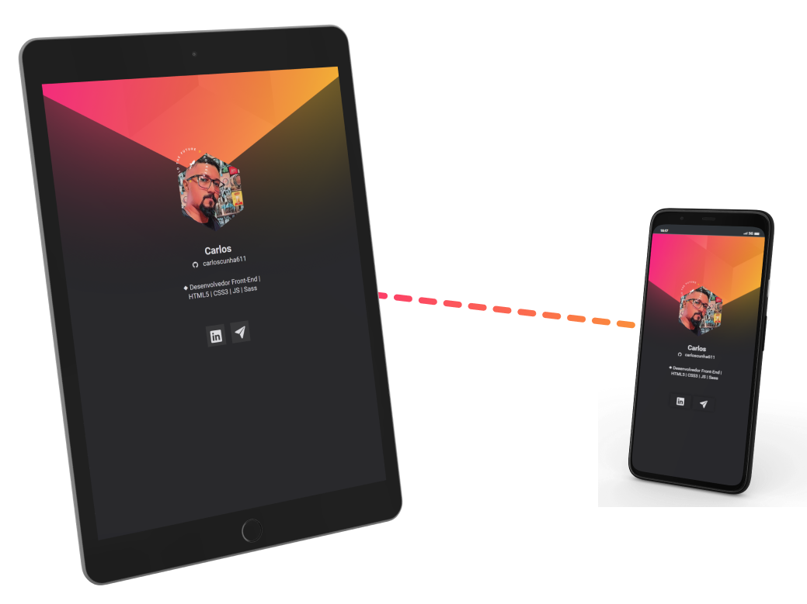

#  Cartão de apresentação

> Projeto desenvolvida no evento online da rocketseat - NLW heat DoWhile.

## 💻 Funcionalidades

- link com redes sociais
- Multiplataforma

## ⚙ Tecnologias

   

## 🔗 Links

<a href = "https://t.me/Carloscunha611"> 
